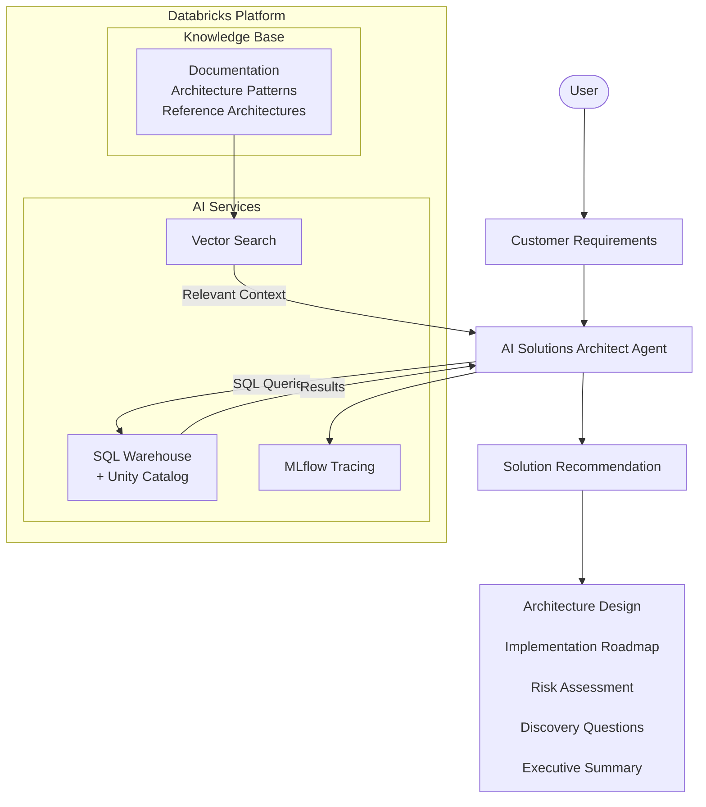

```mermaid
flowchart TD

%% ==========================
%% User
%% ==========================

U([User])
REQ[Customer Requirements]

U --> REQ

%% ==========================
%% AI Agent
%% ==========================

REQ --> AGENT[AI Solutions Architect Agent]

%% ==========================
%% Knowledge & Platform
%% ==========================

subgraph PLATFORM["Databricks Platform"]

direction LR

subgraph KNOW["Knowledge Base"]
KB[Documentation<br/>Architecture Patterns<br/>Reference Architectures]
end

subgraph SERVICES["AI Services"]
VS[Vector Search]
SQL[SQL Warehouse<br/>+ Unity Catalog]
TRACE[MLflow Tracing]
end

KB --> VS

end

VS -->|Relevant Context| AGENT
AGENT -->|SQL Queries| SQL
SQL -->|Results| AGENT
AGENT --> TRACE

%% ==========================
%% Output
%% ==========================

AGENT --> SOL[Solution Recommendation]

SOL --> DELIVERABLES[
Architecture Design<br/>
Implementation Roadmap<br/>
Risk Assessment<br/>
Discovery Questions<br/>
Executive Summary
]
```
