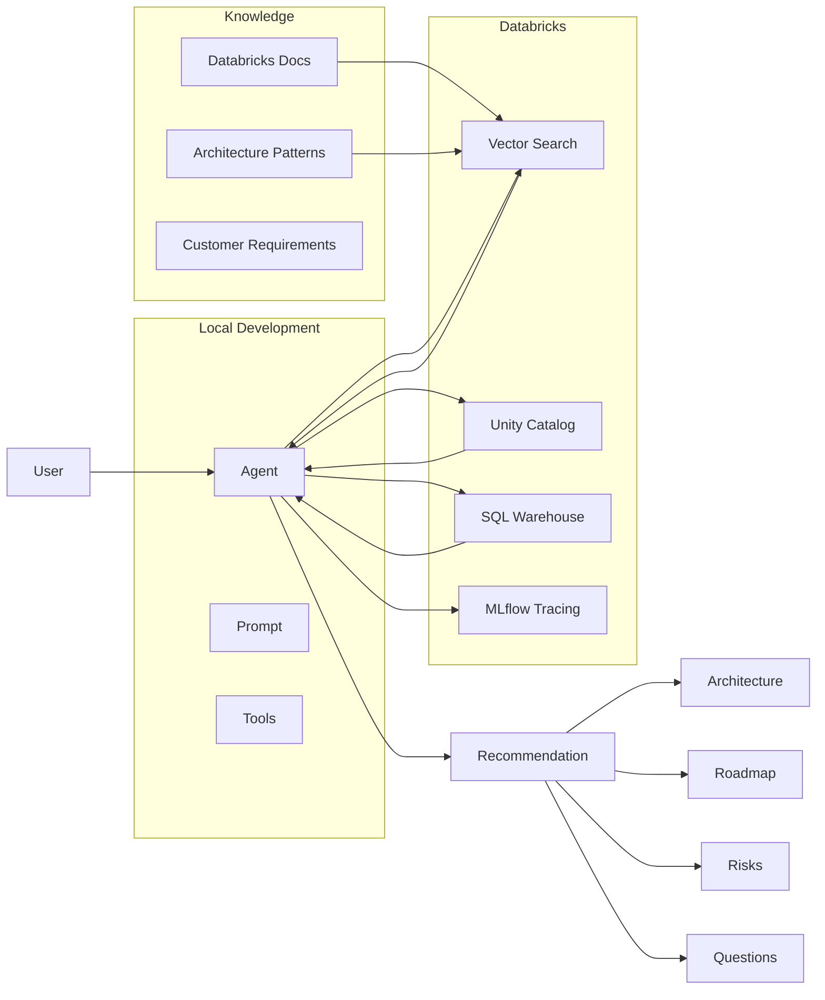

```mermaid
flowchart LR

User --> Agent

subgraph Local Development
    Agent
    Prompt
    Tools
end

subgraph Databricks
    VS[Vector Search]
    UC[Unity Catalog]
    SQL[SQL Warehouse]
    ML[MLflow Tracing]
end

subgraph Knowledge
    Docs[Databricks Docs]
    Patterns[Architecture Patterns]
    Customer[Customer Requirements]
end

Docs --> VS
Patterns --> VS

Agent --> VS
Agent --> SQL
Agent --> UC

SQL --> Agent
VS --> Agent
UC --> Agent

Agent --> ML

Agent --> Recommendation
Recommendation --> Architecture
Recommendation --> Roadmap
Recommendation --> Risks
Recommendation --> Questions
```
