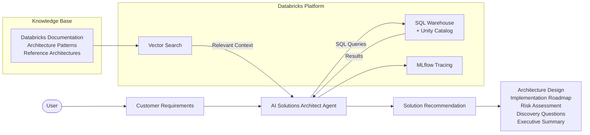

```mermaid
flowchart LR

%% User
U([User])
REQ[Customer Requirements]

U --> REQ

%% AI Agent
AGENT[AI Solutions Architect Agent]

REQ --> AGENT

%% Knowledge Sources
subgraph KNOW["Knowledge Base"]
KB[Databricks Documentation<br/>Architecture Patterns<br/>Reference Architectures]
end

%% Databricks Platform
subgraph DBX["Databricks Platform"]
VS[Vector Search]
DATA[SQL Warehouse<br/>+ Unity Catalog]
OBS[MLflow Tracing]
end

%% Knowledge Retrieval
KB --> VS
VS -->|Relevant Context| AGENT

%% Platform Interaction
AGENT -->|SQL Queries| DATA
DATA -->|Results| AGENT

%% Observability
AGENT --> OBS

%% Outputs
AGENT --> OUT[Solution Recommendation]
OUT --> DELIV[Architecture Design<br/>Implementation Roadmap<br/>Risk Assessment<br/>Discovery Questions<br/>Executive Summary]
```
