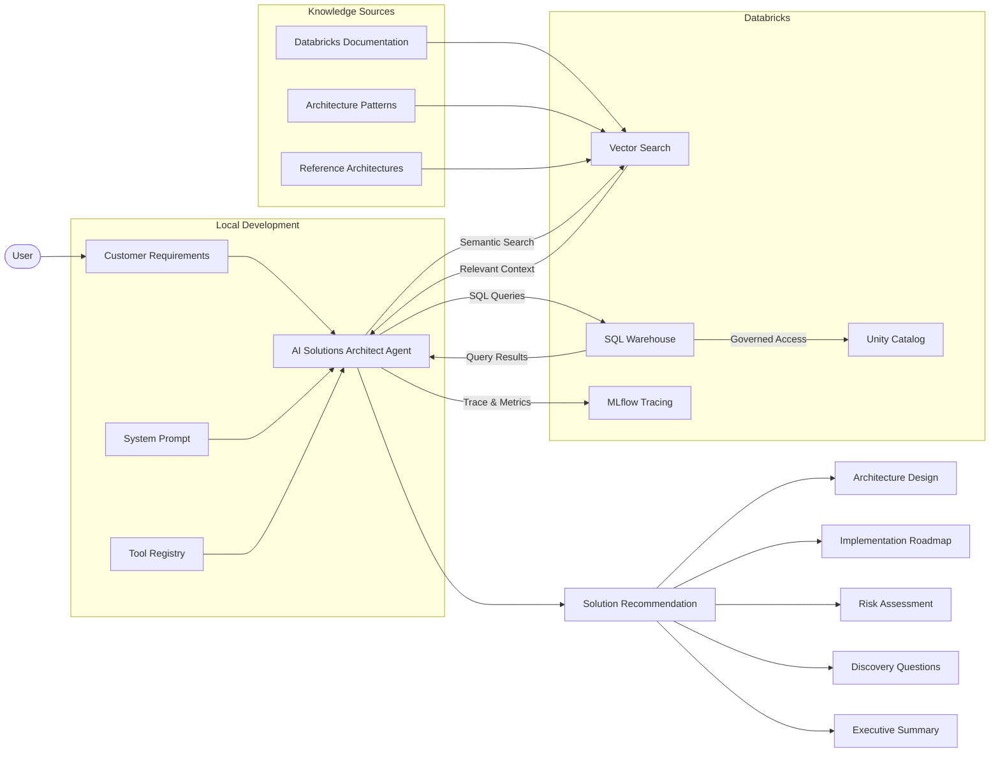

```mermaid
flowchart LR

%% ==========================
%% User
%% ==========================

U([User])
REQ[Customer Requirements]

U --> REQ

%% ==========================
%% Local Development
%% ==========================

subgraph LOCAL["Local Development"]

REQ --> AGENT[AI Solutions Architect Agent]

PROMPT[System Prompt]
TOOLS[Tool Registry]

PROMPT --> AGENT
TOOLS --> AGENT

end

%% ==========================
%% Knowledge Sources
%% ==========================

subgraph KNOW["Knowledge Sources"]

DOCS[Databricks Documentation]
PATTERNS[Architecture Patterns]
REF[Reference Architectures]

end

%% ==========================
%% Databricks Platform
%% ==========================

subgraph DBX["Databricks"]

VS[Vector Search]

SQL[SQL Warehouse]

UC[Unity Catalog]

ML[MLflow Tracing]

end

%% Build the vector index
DOCS --> VS
PATTERNS --> VS
REF --> VS

%% Agent runtime
AGENT -->|Semantic Search| VS
VS -->|Relevant Context| AGENT

AGENT -->|SQL Queries| SQL
SQL -->|Governed Access| UC
SQL -->|Query Results| AGENT

%% Observability
AGENT -->|Trace & Metrics| ML

%% ==========================
%% Outputs
%% ==========================

AGENT --> RESP[Solution Recommendation]

RESP --> ARCH[Architecture Design]
RESP --> ROADMAP[Implementation Roadmap]
RESP --> RISK[Risk Assessment]
RESP --> DISCOVERY[Discovery Questions]
RESP --> SUMMARY[Executive Summary]
```
